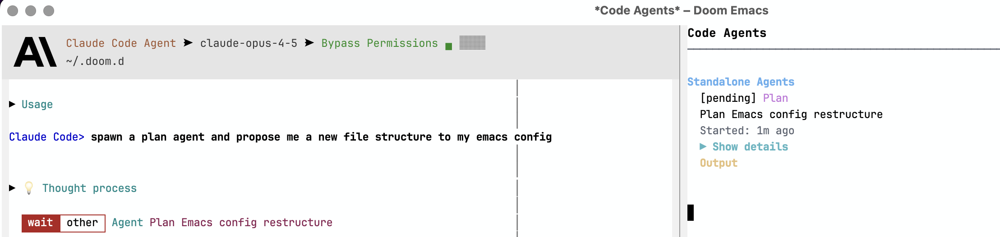
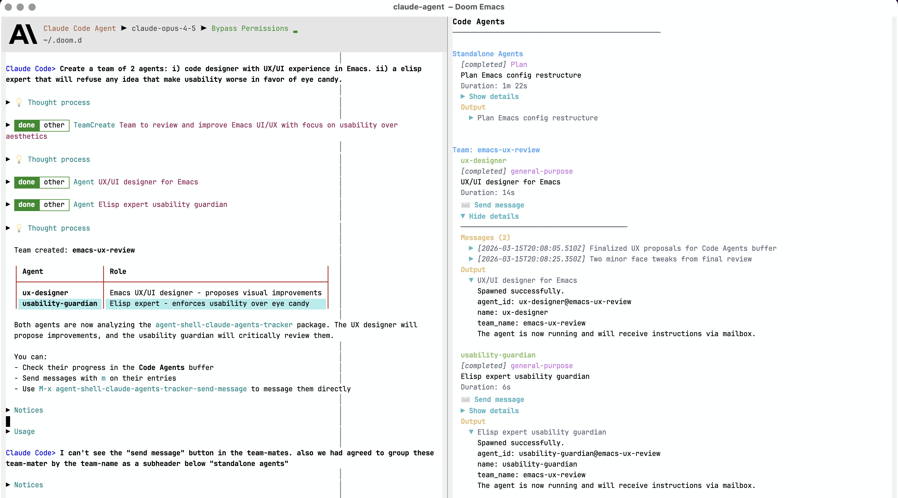

#+TITLE: agent-shell-claude-agents-tracker
#+AUTHOR: Wanderson Ferreira

Track and display subagents spawned by Claude Code within agent-shell sessions.

* Overview

When Claude Code uses the =Agent= tool to spawn subagents (Explore, Plan, general-purpose, etc.),
this package detects and displays them in a dedicated buffer.

* Screenshots

** Standalone Agent

A single Plan agent spawned to research and propose implementation steps:

** Team Collaboration

Two agents working together: a "designer" agent received work from another teammate without explicit user intervention, demonstrating autonomous team coordination:

* Features

- Detects Agent tool invocations via =tool-call-update= events
- Monitors =~/.claude/teams/= for team creation (TeamCreate)
- Displays subagents in a dedicated buffer with status, type, and timing
- *Shows subagent prompt and output* when completed (expandable/collapsible)
- *Send messages to teammates* directly from the tracker
- Mode-line indicator showing running/total counts
- Auto-subscribes to new agent-shell buffers

* Installation

In doom emacs:

add to your packages.el file
#+begin_src emacs-lisp
(package! agent-shell-claude-agents-tracker
  :recipe (:host github
                 :repo "wandersoncferreira/agent-shell-claude-agents-tracker"
                 :branch "main"))
#+end_src

add to your config.el file
#+begin_src emacs-lisp
(use-package! agent-shell-claude-agents-tracker
  :after agent-shell
  :config
  (agent-shell-claude-agents-tracker-mode 1))
#+end_src

* Usage

| Command                                              | Description                                |
|------------------------------------------------------+--------------------------------------------|
| =M-x agent-shell-claude-agents-tracker-show=         | Open the tracker buffer                    |
| =M-x agent-shell-claude-agents-tracker-hide=         | Hide the tracker buffer                    |
| =M-x agent-shell-claude-agents-tracker-toggle=       | Toggle buffer visibility                   |
| =M-x agent-shell-claude-agents-tracker-clear=        | Clear all tracked subagents                |
| =M-x agent-shell-claude-agents-tracker-reset-all=    | Delete a specific team (=C-u= for all)     |
| =M-x agent-shell-claude-agents-tracker-send-message= | Send message to a teammate (=C-u= quiet)   |

** Buffer Keybindings

| Key     | Action                               |
|---------+--------------------------------------|
| =g=     | Refresh                              |
| =q=     | Hide                                 |
| =c=     | Clear all                            |
| =R=     | Reset team (=C-u R= for all)         |
| =m=     | Send message (=C-u m= for quiet)     |
| =TAB=   | Toggle details at point          |
| =RET=   | Toggle details at point          |
| =e=     | Expand all                       |
| =E=     | Collapse all                     |

You can also click on =▶ Show details= buttons to expand/collapse, or =✉ Send message= to message teammates.

** Quiet Messages

By default, when you send a message to a teammate, the tracker sets up continuation
tracking. When all teammates have responded, the team-leader (agent-shell buffer)
receives a notification to continue processing.

Use =C-u= prefix to send a *quiet* message that does NOT trigger continuation:

#+begin_example
C-u m           ; quiet message at point
C-u M-x agent-shell-claude-agents-tracker-send-message
#+end_example

Quiet messages are useful for casual questions where you don't need the team-leader
to be notified when the agent responds.

* Configuration

#+begin_src emacs-lisp
;; Auto-subscribe to new agent-shell buffers (default: t)
(setq agent-shell-claude-agents-tracker-auto-subscribe t)

;; Show mode-line indicator (default: t)
(setq agent-shell-claude-agents-tracker-show-mode-line t)

;; Watch ~/.claude/teams/ for team files (default: t)
(setq agent-shell-claude-agents-tracker-watch-teams t)

;; Buffer width (default: 56)
(setq agent-shell-claude-agents-tracker-sidebar-width 56)

;; Auto-refresh interval in seconds (default: 5)
(setq agent-shell-claude-agents-tracker-refresh-interval 5)

;; Maximum lines of prompt/output to show when expanded (default: 10)
(setq agent-shell-claude-agents-tracker-output-max-lines 10)

;; Drop stale notifications from ACP server (default: t)
;; Set to nil if you want to see all notifications
(setq agent-shell-claude-agents-tracker-drop-stale-notifications t)
#+end_src

* Stale Notification Fix

When you interact with Claude Code agents directly (e.g., via the terminal or another
interface), stale notification messages may leak into the agent-shell buffer when you
return to Emacs.  This happens because the ACP server sends notifications that agent-shell
processes even when there are no active requests.

This package includes a fix that is *enabled by default*.  It advises
=agent-shell--active-requests-p= to properly check if there are active requests before
processing notifications.  When no active requests exist, stale notifications are
silently dropped.

To disable this behavior:

#+begin_src emacs-lisp
(setq agent-shell-claude-agents-tracker-drop-stale-notifications nil)
#+end_src

See [[https://github.com/xenodium/agent-shell/pull/346]] for context on this issue.

* Limitations

- *No real-time subagent output*: Subagents run as internal child processes of Claude Code.
  We can see their final output when completed, but not real-time progress.
- *Detection method*: Agent tool calls are detected by exact title match ("Agent")
  or presence of =subagent_type= field in the tool's raw input.

* How It Works

1. Subscribes to =tool-call-update= events in each agent-shell buffer
2. When an Agent tool call is detected, registers it with metadata
3. Updates status as the tool call progresses (running -> completed)
4. Displays all tracked subagents grouped by parent buffer
5. Optionally watches =~/.claude/teams/= for team creation events
